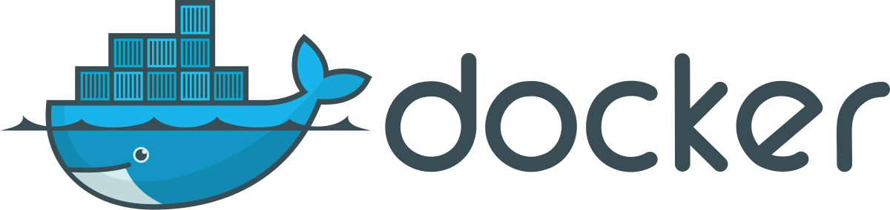
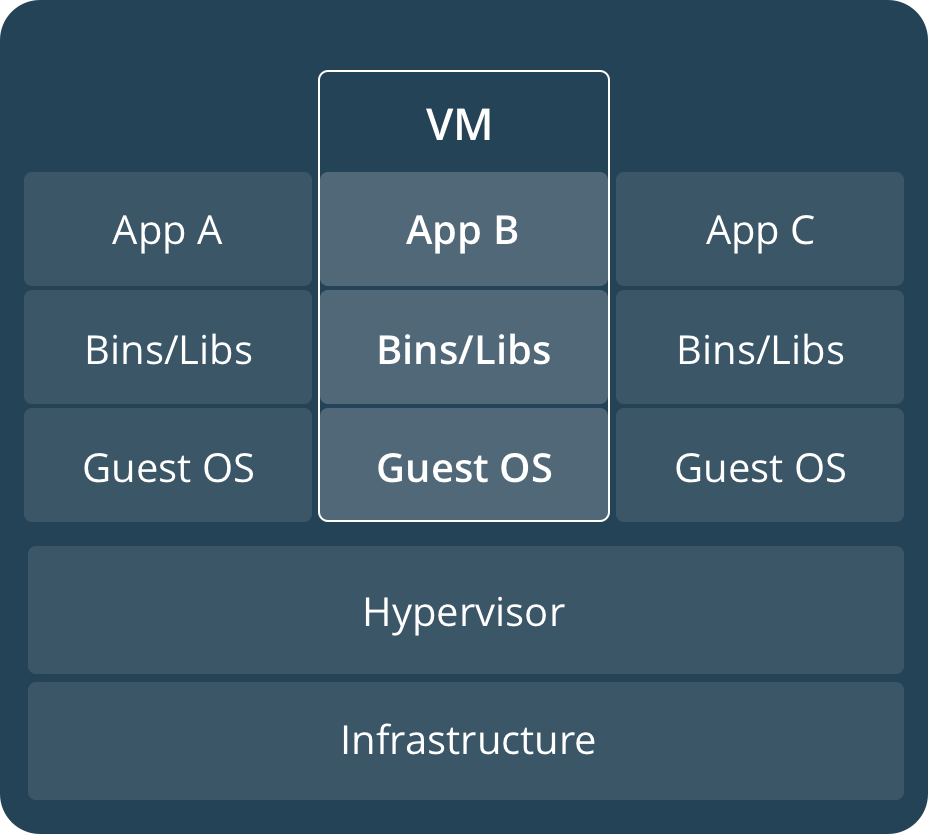
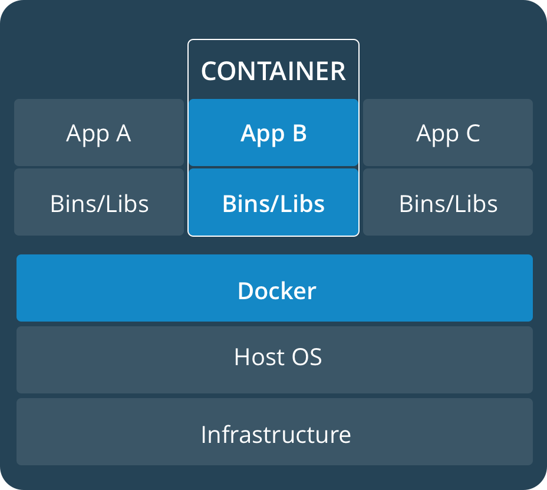
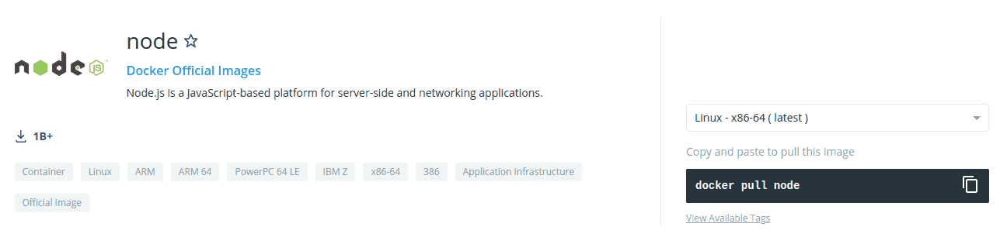
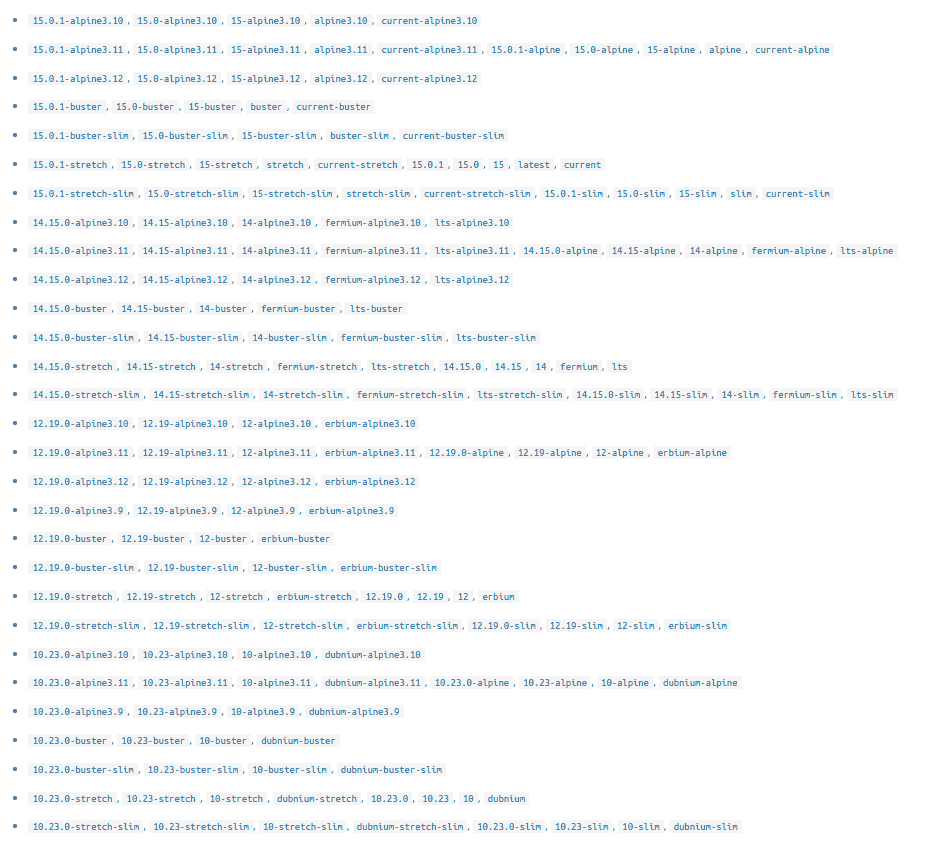
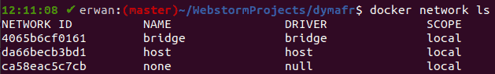

# Docker Formation



## What is Docker ?

Docker is an open source tool developed in Go and created in 2012 by 3 french engineers

A good first definition of Docker is : "A tool used to package an app and its dependencies in an isolated container that can be executed in each environment"

## How docker works ?

Docker can be executed only in a linux environment. For people working on OSX or Windows we must use docker via a virtual machine.
When executing docker on OSX or Windows it will use an hypervisor (Hyper-V for Windows and xhyve for OSX) that will emulate a VM with Linux kernel.

With the linux kernel we can use the docker deamon that will allow us to execute containers.

##### VM vs Docker

A VM is a software machine that is executed on an host machine (a server or a computer). It takes a art of the hardware ressources and use it to run. The principal disadvantage is the loss of ressources because the same quantity of hardware ressources are now use to run more processes.



Docker is very different because it use the linux kernel and it share it to every containers. It means that each container does not have the entire OS (that is a heavy program).



##### Why Docker is only executable on linux ?

Docker is an API that allow use to use the low level featurs of linux easily.

###### Les namespaces

namespaces are a linux feature allowing the creation of isolated spaces on a Linux OS. It is this feature of Linux that gives containers their isolation.

###### Cgroups

Cgroups for "control groups" allows to limit the access to ressources to processes. thanks to this Docker can distribute the different ressources (CPU,GPU,RAM,bandwidth,write and read hard disk) between the different processes.
It is also possible to limit the allowed ressources for each container.

###### UnionFS

UnionFs for (Union File Systeme) is a type of filesystem for linux.
Depending on the Linux distribution, Docker uses one of the available implementations.
These file systems work by creating layers. They are at the heart of Docker images and allow them to be light and very fast.

## Docker Ecosystem

### Docker Engine

##### Docker deamon

The main piece of docker is the docker deamon (dockerd). The docker deamon is the process that will create all the Docker objects (images, containers, volumes... ). The dockerd is blocked and we cannot communicate directy with it.

the Docker Engine is built on the client/server pattern. It is composed of three parts.


###### Docker Client

The docker client is a CLI (command line interface). The CLI translate commands entered by the developer in request for the API

###### Docker server

The docker server is the docker deamon and the API that allow us to communicate with it.

### Docker Objects

###### Images

a Docker image is a readonly schema that contains all the informations to create a Docker container.
To create a Docker image we must use a specific file called Dockerfile (with a specific syntax) used to define the steps necessary to create the image. Most often, an image is itself based on another image

###### Container

a container is a instance of an image running and that can take configuration options set at the launch.We can create as much container as we want from an image. To create, start, stop, move or delete a container, you have to use the CLI.
By default, a container is isolated from other containers and from the host machine. It is of course possible to configure this isolation by modifying the networks to which the container is connected, the storage etc.

###### Volumes

Volumes allow containers to store data. They are initialized when creating a container. They are used to persist and share data from a container.
These volumes are stored outside of the UnionFS system that we have seen. They allow data to be preserved even if a container is deleted, updated or reloaded.

### Scale with Docker

##### Multi-containers app

###### Docker Compose

Docker Compose is the Docker tool for defining and launching multi-container applications. With Docker COmpose we will be able to create a container per service (DB, Auth, API...) and launch all the services of the app with an only command.

##### Multi-host app

Use an orchestrator for multi-host with Docker swarm or Kubernetes

###### Docker Swarm

Docker swarm is the Docker tool to manage multi-host application. It use the same config file that Docker compose but different commands.

###### Kubernets

Kubernets is a tool to manage multi multi-host application developed by Facebook. It allows you to do a lot more things than Docker Swarm but takes a lot longer to learn.

## First Container

#### First run

Docker has an example container that allows you to see how launching a container works.
this image is called `hello-world`

When running `docker run hello-world` we ask the docker deamon (via the docker client) to run a new container from specified image.

In a first time, dockerd will search if the image is locally unable. Because it is the first time that we try to use this image, it was not yet downloaded from the **docker hub** docker indicates that it cannot find the image on your machine :

```bash
Unable to find image 'hello-world:latest' locally
```

The `:latest` is the tag of the image, its version. By default if we don't provide a tag, docker will search on the registry (Docker Hub) the latest version.

`latest: Pulling from library/hello-world`

Docker will then retrieve the image from the configured registry (which is Docker Hub by default). It actually runs `docker pull hello-world`

```bash
0e03bdcc26d7: Pull complete
Digest: sha256:7e02330c713f93b1d3e4c5003350d0dbe215ca269dd1d84a4abc577908344b30
Status: Downloaded newer image for hello-world:latest
```

Docker indicates that the download (pull) is completed. It provides the **digest** of the image that is its unique id (this is actually a SHA256 hash of the image's JSON configuration).

The rest of the message is displayed by the container. To display the message, the docker deamon created a new container based on on the hello-world image.

```bash
Hello from Docker!
This message shows that your installation appears to be working correctly.

To generate this message, Docker took the following steps:
 1. The Docker client contacted the Docker daemon.
 2. The Docker daemon pulled the "hello-world" image from the Docker Hub.
    (amd64)
 3. The Docker daemon created a new container from that image which runs the
    executable that produces the output you are currently reading.
 4. The Docker daemon streamed that output to the Docker client, which sent it
    to your terminal.

To try something more ambitious, you can run an Ubuntu container with:
 $ docker run -it ubuntu bash

Share images, automate workflows, and more with a free Docker ID:
 https://hub.docker.com/

For more examples and ideas, visit:
 https://docs.docker.com/get-started/
```

#### Rerun

If we rerun the image, all the download phase disparaître

```bash
Hello from Docker!
This message shows that your installation appears to be working correctly.

To generate this message, Docker took the following steps:
 1. The Docker client contacted the Docker daemon.
 2. The Docker daemon pulled the "hello-world" image from the Docker Hub.
    (amd64)
 3. The Docker daemon created a new container from that image which runs the
    executable that produces the output you are currently reading.
 4. The Docker daemon streamed that output to the Docker client, which sent it
    to your terminal.

To try something more ambitious, you can run an Ubuntu container with:
 $ docker run -it ubuntu bash

Share images, automate workflows, and more with a free Docker ID:
 https://hub.docker.com/

For more examples and ideas, visit:
 https://docs.docker.com/get-started/
```

Indeed the image has already been pull. we can verify if an image is already available locally with the following command `docker images`

```bash
REPOSITORY    TAG       IMAGE ID       CREATED         SIZE
hello-world   latest    bf756fb1ae65   14 months ago   13.3kB
```

we can also list the different containers usig `docker container ls -a`

```bash
CONTAINER ID   IMAGE         COMMAND    CREATED         STATUS                     PORTS     NAMES
ed74998d24d8   hello-world   "/hello"   4 minutes ago   Exited (0) 4 minutes ago             admiring_lewin
c091bf98a2af   hello-world   "/hello"   2 hours ago     Exited (0) 2 hours ago               strange_chatelet
78983cf4b0a2   hello-world   "/hello"   2 hours ago     Exited (0) 2 hours ago               lucid_gates
```

we can see that each run of the hello-world image create a new container.

## Run a container

#### The `run` command

the docker `run` command is an allias for multiple commands :

```bash
docker pull image
docker container create -d image
docker container start ID
docker container -a ID
```

#### The `-i` option

The `-i` option (alias for `--interactive`) is an option which allows to keep the standard input open even if the process is started by default in the background or if it does not start a service and therefore quits immediately.

To try it we will use the alpine image. Alpine is a distribution of Linux that has the particularity to be very light (5.57Mb vs 80Mb for Ubuntu)

if we run alpine image to create a new container we can see that except the pull phase nothing is happening. Indeed this image does not launch any program by default and since there is nothing to execute the contaner (that is a process) stops.

if we run now the same command with the `-i` option, the container does not stop and we can writ einside.

if we write `ls` to list repositories the return is :

```zsh
ls
bin
dev
etc
home
lib
media
mnt
opt
proc
root
run
sbin
srv
sys
tmp
usr
var
```

#### the `-t` option

the `-t` option (alias for `--tty`) launch a terminal and allocate it to the container

running the `-t` option in addition to the` -i` option open an sh terminal connected to the container and so to the Alpine OS.

if we run `docker run -it alpine` and we print ls we now have the formatted repositories list.

```sh
bin    dev    etc    home   lib    media  mnt    opt    proc   root   run    sbin   srv    sys    tmp    usr    var
```

#### background and foreground mode

###### Foreground mode

By default the `run` command execute the container in foreground.
If we run `docker run alpine ping google.fr`

_Here it will create and start an alpine container and ask it to start the `ping google.fr` command.
This command sends packets at regular time intervals to google.fr to obtain network statistics._

We can see that the standard output, the error output and the standard input of the container are connected to the terminal. We can see the following return :

```sh
PING google.fr (172.217.18.195): 56 data bytes
64 bytes from 172.217.18.195: seq=0 ttl=37 time=45.958 ms
64 bytes from 172.217.18.195: seq=1 ttl=37 time=46.778 ms
64 bytes from 172.217.18.195: seq=2 ttl=37 time=93.455 ms
64 bytes from 172.217.18.195: seq=3 ttl=37 time=45.174 ms
64 bytes from 172.217.18.195: seq=4 ttl=37 time=45.841 ms
64 bytes from 172.217.18.195: seq=5 ttl=37 time=51.209 ms
64 bytes from 172.217.18.195: seq=6 ttl=37 time=56.460 ms
64 bytes from 172.217.18.195: seq=7 ttl=37 time=46.567 ms
64 bytes from 172.217.18.195: seq=8 ttl=37 time=45.386 ms
```

thanks to the connexion of the standard input of the container to host's terminal we can stop the process using `ctrl + C`

###### Background mode

To run a container in background mode we must add the `-d` otion (alias for `--detach`)

`docker run -d alpine ping google.fr`

The container is not lunched in interactive mode so the input and output are not connected to the host's terminal. We can not interact with the container and it can not interact with us.

we can display the logs of this container using the `docker logs` command followed by the container id :
`docker logs 8f7ecaf543f89ddef1a268b10482aaf752e358e970495c48bd3132f2b42297cb`

```sh
PING google.fr (172.217.18.195): 56 data bytes
64 bytes from 172.217.18.195: seq=0 ttl=37 time=46.762 ms
64 bytes from 172.217.18.195: seq=1 ttl=37 time=47.150 ms
64 bytes from 172.217.18.195: seq=2 ttl=37 time=51.822 ms
64 bytes from 172.217.18.195: seq=3 ttl=37 time=52.184 ms
64 bytes from 172.217.18.195: seq=4 ttl=37 time=45.302 ms
64 bytes from 172.217.18.195: seq=5 ttl=37 time=45.143 ms
64 bytes from 172.217.18.195: seq=6 ttl=37 time=63.402 ms
64 bytes from 172.217.18.195: seq=7 ttl=37 time=51.428 ms
```

## Basic Commands & help

To display the list of the commands we can type `docker`

```bash
Management Commands:
  app*        Docker App (Docker Inc., v0.9.1-beta3)
  builder     Manage builds
  buildx*     Build with BuildKit (Docker Inc., v0.5.1-docker)
  config      Manage Docker configs
  container   Manage containers
  context     Manage contexts
  image       Manage images
  manifest    Manage Docker image manifests and manifest lists
  network     Manage networks
  node        Manage Swarm nodes
  plugin      Manage plugins
  scan*       Docker Scan (Docker Inc., v0.5.0)
  secret      Manage Docker secrets
  service     Manage services
  stack       Manage Docker stacks
  swarm       Manage Swarm
  system      Manage Docker
  trust       Manage trust on Docker images
  volume      Manage volumes

Commands:
  attach      Attach local standard input, output, and error streams to a running container
  build       Build an image from a Dockerfile
  commit      Create a new image from a container's changes
  cp          Copy files/folders between a container and the local filesystem
  create      Create a new container
  diff        Inspect changes to files or directories on a container's filesystem
  events      Get real time events from the server
  exec        Run a command in a running container
  export      Export a container's filesystem as a tar archive
  history     Show the history of an image
  images      List images
  import      Import the contents from a tarball to create a filesystem image
  info        Display system-wide information
  inspect     Return low-level information on Docker objects
  kill        Kill one or more running containers
  load        Load an image from a tar archive or STDIN
  login       Log in to a Docker registry
  logout      Log out from a Docker registry
  logs        Fetch the logs of a container
  pause       Pause all processes within one or more containers
  port        List port mappings or a specific mapping for the container
  ps          List containers
  pull        Pull an image or a repository from a registry
  push        Push an image or a repository to a registry
  rename      Rename a container
  restart     Restart one or more containers
  rm          Remove one or more containers
  rmi         Remove one or more images
  run         Run a command in a new container
  save        Save one or more images to a tar archive (streamed to STDOUT by default)
  search      Search the Docker Hub for images
  start       Start one or more stopped containers
  stats       Display a live stream of container(s) resource usage statistics
  stop        Stop one or more running containers
  tag         Create a tag TARGET_IMAGE that refers to SOURCE_IMAGE
  top         Display the running processes of a container
  unpause     Unpause all processes within one or more containers
  update      Update configuration of one or more containers
  version     Show the Docker version information
  wait        Block until one or more containers stop, then print their exit codes
```

This list is composed of two parts:
--> Management Commands (list different Docker objects)
--> Commands (list every commands)

We can list the command that concern a specific Docker object adding the name of this object after the `docker command`. Enter `docker image` will show all the commands about images.

##### List entities

like on a linux system we can use the `ls` and `ls -a` commands to list entities.

`docker image ls` will list all images present locally

```bash
REPOSITORY    TAG       IMAGE ID       CREATED         SIZE
alpine        latest    28f6e2705743   2 weeks ago     5.61MB
hello-world   latest    bf756fb1ae65   14 months ago   13.3kB
```

`docker container ls` will list all container running

```bash
CONTAINER ID   IMAGE     COMMAND            CREATED        STATUS        PORTS     NAMES
8f7ecaf543f8   alpine    "ping google.fr"   12 hours ago   Up 12 hours             jovial_jennings
```

`docker container ls -a` will list all containers running or not

```bash
CONTAINER ID   IMAGE         COMMAND            CREATED        STATUS                      PORTS     NAMES
8f7ecaf543f8   alpine        "ping google.fr"   12 hours ago   Up 12 hours                           jovial_jennings
6e8e616f05c1   alpine        "ping google.fr"   12 hours ago   Exited (0) 12 hours ago               inspiring_jepsen
bfc02a59d1dd   alpine        "/bin/sh"          12 hours ago   Exited (0) 12 hours ago               nervous_clarke
cf50a31ec24e   alpine        "/bin/sh"          12 hours ago   Exited (0) 12 hours ago               loving_shtern
2999df98bd9c   alpine        "/bin/sh"          13 hours ago   Exited (0) 13 hours ago               fervent_murdock
221a5f2b17e3   alpine        "/bin/sh"          13 hours ago   Exited (0) 13 hours ago               amazing_liskov
7f85275382e6   alpine        "/bin/sh"          13 hours ago   Exited (127) 13 hours ago             serene_rosalind
459fb0ed52c3   alpine        "/bin/sh"          13 hours ago   Exited (0) 13 hours ago               practical_banach
ed74998d24d8   hello-world   "/hello"           14 hours ago   Exited (0) 14 hours ago               admiring_lewin
c091bf98a2af   hello-world   "/hello"           16 hours ago   Exited (0) 16 hours ago               strange_chatelet
78983cf4b0a2   hello-world   "/hello"           16 hours ago   Exited (0) 16 hours ago               lucid_gates
```

##### Delete entity

###### Images

To remove an entity we can use the `rm` command. We must provide either the `IMAGE ID` or the name of the image to specify which one we want to delete.

```bash
docker image rm 28f6e2705743
Error response from daemon: conflict: unable to delete 28f6e2705743 (cannot be forced) - image is being used by running container 8f7ecaf543f8
```

Note that we cannot delete an image that is used by a container. (We can force the deletion by using the `-f` option on `rm` but it can be risky for the container)

###### Containers

We can delete a container using the same command.

```bash
docker container rm 78983cf4b0a2
```

or we can delete all the containers that are not currently running.

```bash
~ % docker container prune
WARNING! This will remove all stopped containers.
Are you sure you want to continue? [y/N] y
Deleted Containers:
6e8e616f05c1677eb895ced24e38088662b0278f3c497ec90555fb9c7b7a69e2
bfc02a59d1ddac617559c6ad9c74bd6a7d2c12880e5d695f012586e677350ff3
cf50a31ec24e2f7586ea99f1e535922ffc24681ebf8c8f603fa39d90ec0ffa5c
2999df98bd9c0c53dded3ee37f5218de0d66e92f0abf52d24b78280d9026ea22
221a5f2b17e32773300f5bff34fc21e1b1925c1a940b040f89cdd6cf294ea252
7f85275382e6d5cad5f1ad3420b21c8d9ed71fecb9267ceaec55905b4bc1c8d3
459fb0ed52c31b79d503cd046c1bb61ffc0222ec305f38f582b4aaaf323375fb
ed74998d24d888aa3661ed8a10f0014bf0633504350f14efe40e933f9833b642
c091bf98a2af4d8cab6bff11b5f2bc4602fb00e10403ef602f7ab61461b9e9ff

Total reclaimed space: 21B
```

We can verify the deletion with :

```bash
~ % docker container ls -a
CONTAINER ID   IMAGE     COMMAND            CREATED        STATUS        PORTS     NAMES
8f7ecaf543f8   alpine    "ping google.fr"   12 hours ago   Up 12 hours             jovial_jennings
```

Now that we have delete all the containers who used the `hello-world` image we can delete the image.

```bash
~ % docker image rm hello-world
Untagged: hello-world:latest
Untagged: hello-world@sha256:7e02330c713f93b1d3e4c5003350d0dbe215ca269dd1d84a4abc577908344b30
Deleted: sha256:bf756fb1ae65adf866bd8c456593cd24beb6a0a061dedf42b26a993176745f6b
Deleted: sha256:9c27e219663c25e0f28493790cc0b88bc973ba3b1686355f221c38a36978ac63
```

```bash
~ % docker image ls
REPOSITORY   TAG       IMAGE ID       CREATED       SIZE
alpine       latest    28f6e2705743   2 weeks ago   5.61MB
```

If we want to delete the container that is running we must add the `-f` option to force the deletion.

```bash
~ % docker container rm -f 8f7ecaf543f8
8f7ecaf543f8
```

We can have some help about a command by adding the `--help` option.

We can also use the `docker system prune` command to delete :

- All Containers that are not currently running
- All Networks that are not used by a running container
- All dangling images (image that are not described by a tag) that are not used for running a container
- All caches used for the creation of Docker images

we can add the `-a` option to delete moreover all taged images that are not used by a running container.

## Container LifeCycle

We saw that the `docker run`command creates and start a container but we can do these actions separately.

#### Create Container

`docker container create IMAGE_NAME` create a new container but it does not start it. It is usefull if we want configure the container.

```bash
~ % docker container create alpine
3bfd8cebb045b3517039eb2c208525d5ce809462724369a5f4b8454a391534f1
```

we can see the container with the `docker ps -a` command (alias for `docker container ls -a`). Its status is `CREATED`

```bash
~ % docker ps -a
CONTAINER ID   IMAGE     COMMAND     CREATED         STATUS    PORTS     NAMES
3bfd8cebb045   alpine    "/bin/sh"   6 seconds ago   Created             friendly_boyd
```

We can pass config options at the creation of the container. Here we create a new container from the "alpine" image in interactive mode with a terminal and we call it alpine1 and we

```bash
docker container create --name alpine1 -it  alpine
```

#### Start Container

Docker provides the `docker container start CONTAINER_NAME_OR_ID` to start a container already created.

The `start` command cannot change options passed at the creation of the container

If we create a container without `-it` option and we try to start it with -ai option it wont works.

The `-a` option (for `--attach`) attaches standard output (STDOUT) and error output (STDERR) to your terminal. In other words, this will display the output streams of your container in your terminal as if you were in the container.

The `-i` option for `--interactive` attaches the standard input (STDIN) of your terminal to the container. In other words, it allows you to type commands in your terminal as if you were in the container.

#### Stop a container

To stop a container we must use `docker scontainer stop` or `docker stop`

```bash
~ % docker create --name googlePing alpine ping google.com
4d9a72a2a5020ab41bcc9a7f6cfca62b76467af5e38a7df7d103d7b14a23c93b

~ % docker ps -a
CONTAINER ID   IMAGE     COMMAND             CREATED         STATUS    PORTS     NAMES
4d9a72a2a502   alpine    "ping google.com"   8 seconds ago   Created             googlePing
```

here I create a new container with the name "googlePing" that will execute the command `ping google.com`

then I can start it using either its name or its Id

```bash
~ % docker container start googlePing
googlePing
```

we can verify if the container is running

```bash
 ~ % docker ps
CONTAINER ID   IMAGE     COMMAND             CREATED          STATUS          PORTS     NAMES
4d9a72a2a502   alpine    "ping google.com"   10 minutes ago   Up 10 seconds             googlePing
```

finally we can stop the container.

```bash
~ % docker container stop googlePing
googlePing
```

:warning: In fact, `docker container stop` sends a **SIGTERM** to give the container time to perform any cleaning / backup tasks before shutting down.
If after a few seconds the container is still running, the daemon then sends a **SIGKILL** to the container to force its interruption
Here it is because the ping command does not have a code to respond to a **SIGTERM**.

#### Kill a container

We can also directly kill a process with `docker container kill` or `docker kill`.

this command will directly stop the container.

###### Kill all containers running

To kill all containers currently running we can type `docker stop &(docker container ls -aq)`.
this command will take the result of `docker container ls -aq` (a list of container ID) and will stop each container.

## Docker pause, unpause, exec and rename

#### pause and unpause

##### Pause

The `docker container pause NAME_OR_ID` command allows to suspend all the processes of one or more specified containers.

It actually uses the functionality of the Linux kernel of cgroup freezers which allows to suspend processes without sending signals (SIGSTOP).
This effectively allows the processes to be unable to react because no signal is being sent and to "freeze" them.

the `STATUS` of the container will stay "UP"

##### unpause

To stop the pause we need to use the `docker container unpause NAME_OR_ID` command.

#### Rename

It is possible to give a specific name at the creation of a container with the `--name` option but it is also possible to change the name after the creation.

To do this we will use the following command

```bash
docker container rename NAME_OR_ID newName
```

#### Exec

for executing commands in running containers we must use the `docker container exec COMMAND` command
`exec` can also take options like `-i` or `-t`.

:warning: `docker exec` works only on running containers

###### Exemple :

:arrow_down: start a new container redis called redis in background :arrow_down:

```bash
docker run -d --name redis redis
```

:arrow_down: execute a commande that run the redis CLI :arrow_down:

```bash
~ % docker exec -it redis redis-cli
127.0.0.1:6379> set name maxime
OK
127.0.0.1:6379> get name
"maxime"
127.0.0.1:6379>
```

###### Get a shell in any running container

To get a shell in any running container we can use the following commands :

- `docker exec -it NAME_OR_ID bash`
- `docker exec -it NAME_OR_ID sh` use sh if bash is not installed like in alpine distrib of linux

## copy files and inspect container

#### copy files

to copy a file we will use the `docker container cp source-path CONTAINER:destination-path` command
this command will works can import whether the container is running or not.

#### Inspect changes in file system

we can inspect the files that have been modified using the `docker container diff CONTAINER` command.

```bash
~ % docker run --name test -it alpine
/ # ls
bin    dev    etc    home   lib    media  mnt    opt    proc   root   run    sbin   srv    sys    tmp    usr    var
/ # touch /home/logs.txt
/ # cd /home
/home # ls
logs.txt
/home # exit

~ % docker container diff test
C /root
A /root/.ash_history
C /home
A /home/logs.txt
```

- La lettre A signifie qu'un fichier ou un dossier a été ajouté.

- La lettre D signifie qu'un fichier ou un dossier a été supprimé.

- La lettre C signifie qu'un fichier ou un dossier a été modifié.

#### Inspect container's settings

with `docker container inspect CONTAINER` will return a JSON file listing all the options of the container.

`docker container inspect test`

<details>
<summary>see the return</summary>
```bash
[
    {
        "Id": "e67d8aef66e8abffd377f0b998e21db4ae06db2c66ddcadcbd6c45472c75ce77",
        "Created": "2021-03-06T15:27:47.588161Z",
        "Path": "/bin/sh",
        "Args": [],
        "State": {
            "Status": "exited",
            "Running": false,
            "Paused": false,
            "Restarting": false,
            "OOMKilled": false,
            "Dead": false,
            "Pid": 0,
            "ExitCode": 130,
            "Error": "",
            "StartedAt": "2021-03-06T15:27:47.8657442Z",
            "FinishedAt": "2021-03-06T15:29:38.766589Z"
        },
        "Image": "sha256:28f6e27057430ed2a40dbdd50d2736a3f0a295924016e294938110eeb8439818",
        "ResolvConfPath": "/var/lib/docker/containers/e67d8aef66e8abffd377f0b998e21db4ae06db2c66ddcadcbd6c45472c75ce77/resolv.conf",
        "HostnamePath": "/var/lib/docker/containers/e67d8aef66e8abffd377f0b998e21db4ae06db2c66ddcadcbd6c45472c75ce77/hostname",
        "HostsPath": "/var/lib/docker/containers/e67d8aef66e8abffd377f0b998e21db4ae06db2c66ddcadcbd6c45472c75ce77/hosts",
        "LogPath": "/var/lib/docker/containers/e67d8aef66e8abffd377f0b998e21db4ae06db2c66ddcadcbd6c45472c75ce77/e67d8aef66e8abffd377f0b998e21db4a
e06db2c66ddcadcbd6c45472c75ce77-json.log",
        "Name": "/test",
        "RestartCount": 0,
        "Driver": "overlay2",
        "Platform": "linux",
        "MountLabel": "",
        "ProcessLabel": "",
        "AppArmorProfile": "",
        "ExecIDs": null,
        "HostConfig": {
            "Binds": null,
            "ContainerIDFile": "",
            "LogConfig": {
                "Type": "json-file",
                "Config": {}
            },
            "NetworkMode": "default",
            "PortBindings": {},
            "RestartPolicy": {
                "Name": "no",
                "MaximumRetryCount": 0
            },
            "AutoRemove": false,
            "VolumeDriver": "",
            "VolumesFrom": null,
            "CapAdd": null,
            "CapDrop": null,
            "CgroupnsMode": "host",
            "Dns": [],
            "DnsOptions": [],
            "DnsSearch": [],
            "ExtraHosts": null,
            "GroupAdd": null,
            "IpcMode": "private",
            "Cgroup": "",
            "Links": null,
            "OomScoreAdj": 0,
            "PidMode": "",
            "Privileged": false,
            "PublishAllPorts": false,
            "ReadonlyRootfs": false,
            "SecurityOpt": null,
            "UTSMode": "",
            "UsernsMode": "",
            "ShmSize": 67108864,
            "Runtime": "runc",
            "ConsoleSize": [
                0,
                0
            ],
            "Isolation": "",
            "CpuShares": 0,
            "Memory": 0,
            "NanoCpus": 0,
            "CgroupParent": "",
            "BlkioWeight": 0,
            "BlkioWeightDevice": [],
            "BlkioDeviceReadBps": null,
            "BlkioDeviceWriteBps": null,
            "BlkioDeviceReadIOps": null,
            "BlkioDeviceWriteIOps": null,
            "CpuPeriod": 0,
            "CpuQuota": 0,
            "CpuRealtimePeriod": 0,
            "CpuRealtimeRuntime": 0,
            "CpusetCpus": "",
            "CpusetMems": "",
            "Devices": [],
            "DeviceCgroupRules": null,
            "DeviceRequests": null,
            "KernelMemory": 0,
            "KernelMemoryTCP": 0,
            "MemoryReservation": 0,
            "MemorySwap": 0,
            "MemorySwappiness": null,
            "OomKillDisable": false,
            "PidsLimit": null,
            "Ulimits": null,
            "CpuCount": 0,
            "CpuPercent": 0,
            "IOMaximumIOps": 0,
            "IOMaximumBandwidth": 0,
            "MaskedPaths": [
                "/proc/asound",
                "/proc/acpi",
                "/proc/kcore",
                "/proc/keys",
                "/proc/latency_stats",
                "/proc/timer_list",
                "/proc/timer_stats",
                "/proc/sched_debug",
                "/proc/scsi",
                "/sys/firmware"
            ],
            "ReadonlyPaths": [
                "/proc/bus",
                "/proc/fs",
                "/proc/irq",
                "/proc/sys",
                "/proc/sysrq-trigger"
            ]
        },
        "GraphDriver": {
            "Data": {
                "LowerDir": "/var/lib/docker/overlay2/2696b3e3a578d9ef3c5f7a10f07e56a33fd6f03a6098442b116ca5aaafe4c146-init/diff:/var/lib/docker/overlay2/45493222f0d1d509e04d2e6fcecc21a7a523d5889e4e4ffe7c9c7f1e618cff5f/diff",
                "MergedDir": "/var/lib/docker/overlay2/2696b3e3a578d9ef3c5f7a10f07e56a33fd6f03a6098442b116ca5aaafe4c146/merged",
                "UpperDir": "/var/lib/docker/overlay2/2696b3e3a578d9ef3c5f7a10f07e56a33fd6f03a6098442b116ca5aaafe4c146/diff",
                "WorkDir": "/var/lib/docker/overlay2/2696b3e3a578d9ef3c5f7a10f07e56a33fd6f03a6098442b116ca5aaafe4c146/work"
            },
            "Name": "overlay2"
        },
        "Mounts": [],
        "Config": {
            "Hostname": "e67d8aef66e8",
            "Domainname": "",
            "User": "",
            "AttachStdin": true,
            "AttachStdout": true,
            "AttachStderr": true,
            "Tty": true,
            "OpenStdin": true,
            "StdinOnce": true,
            "Env": [
                "PATH=/usr/local/sbin:/usr/local/bin:/usr/sbin:/usr/bin:/sbin:/bin"
            ],
            "Cmd": [
                "/bin/sh"
            ],
            "Image": "alpine",
            "Volumes": null,
            "WorkingDir": "",
            "Entrypoint": null,
            "OnBuild": null,
            "Labels": {}
        },
        "NetworkSettings": {
            "Bridge": "",
            "SandboxID": "eb662d623f35dbf668a340aa1207513050f16e44131c78ed13c80ba7ee52daff",
            "HairpinMode": false,
            "LinkLocalIPv6Address": "",
            "LinkLocalIPv6PrefixLen": 0,
            "Ports": {},
            "SandboxKey": "/var/run/docker/netns/eb662d623f35",
            "SecondaryIPAddresses": null,
            "SecondaryIPv6Addresses": null,
            "EndpointID": "",
            "Gateway": "",
            "GlobalIPv6Address": "",
            "GlobalIPv6PrefixLen": 0,
            "IPAddress": "",
            "IPPrefixLen": 0,
            "IPv6Gateway": "",
            "MacAddress": "",
            "Networks": {
                "bridge": {
                    "IPAMConfig": null,
                    "Links": null,
                    "Aliases": null,
                    "NetworkID": "203bb580fc65093d965661a89da3bcdf85e6edc0cfbc098453187fc89b569d47",
                    "EndpointID": "",
                    "Gateway": "",
                    "IPAddress": "",
                    "IPPrefixLen": 0,
                    "IPv6Gateway": "",
                    "GlobalIPv6Address": "",
                    "GlobalIPv6PrefixLen": 0,
                    "MacAddress": "",
                    "DriverOpts": null
                }
            }
        }
    }
]
```
</details>

#### Inspect resource consumption

the `docker container stats` command lists every container and give us informations about ressources they consume (CPU, Memory...)

## Dockerfile

#### What is a Dockerfile

A Dockerfile contains instructions for Docker to build an image automatically.

A Dockerfile is made up of three parts:

- A **basic image**. This is the image from which you will make the modifications to create your image. You are not going to create an operating system on your own!

- The **instructions**. They are Docker commands allowing you to detail all the modifications to be made to the base image to lead to your final image, for example your backend application.

- The **action**. This is the command that is executed by default when the image is launched in a container.

#### Dockerfile syntax

The syntax of the Dockerfile is as follows:

```Docker
# Comment
INSTRUCTION arguments
```

Arguments are passed to each statement and can be written over multiple lines for readability using `\`

#### First Dockerfile

the first container we will build is a container that has "alpine" as basic image, install node and execute a program that will print "hello world"

:arrow_down: Dockerfile content :arrow_down:

```Docker
FROM alpine

RUN apk add --update nodejs
# this command will install node on alpine

COPY  ./helloWorld.js /app/
# this command copy the helloWOrld file from the host machine to the container.

CMD [ "node", "/app/helloWorld.js" ]
# this command will execute the helloWorld.js file using node.
```

#### Build an image

to create an image with a Dockerfile we must use the `docker image build PATH_TO_DOCKERFILE` command.

```sh
% docker build -t node:latest ./
[+] Building 16.9s (8/8) FINISHED
 => [internal] load build definition from Dockerfile                                                                                        0.0s
 => => transferring dockerfile: 338B                                                                                                        0.0s
 => [internal] load .dockerignore                                                                                                           0.0s
 => => transferring context: 2B                                                                                                             0.0s
 => [internal] load metadata for docker.io/library/alpine:latest                                                                            2.7s
 => [1/3] FROM docker.io/library/alpine@sha256:a75afd8b57e7f34e4dad8d65e2c7ba2e1975c795ce1ee22fa34f8cf46f96a3be                             2.4s
 => => resolve docker.io/library/alpine@sha256:a75afd8b57e7f34e4dad8d65e2c7ba2e1975c795ce1ee22fa34f8cf46f96a3be                             0.0s
 => => sha256:a75afd8b57e7f34e4dad8d65e2c7ba2e1975c795ce1ee22fa34f8cf46f96a3be 1.64kB / 1.64kB                                              0.0s
 => => sha256:4661fb57f7890b9145907a1fe2555091d333ff3d28db86c3bb906f6a2be93c87 528B / 528B                                                  0.0s
 => => sha256:28f6e27057430ed2a40dbdd50d2736a3f0a295924016e294938110eeb8439818 1.47kB / 1.47kB                                              0.0s
 => => sha256:ba3557a56b150f9b813f9d02274d62914fd8fce120dd374d9ee17b87cf1d277d 2.81MB / 2.81MB                                              1.9s
 => => extracting sha256:ba3557a56b150f9b813f9d02274d62914fd8fce120dd374d9ee17b87cf1d277d                                                   0.4s
 => [internal] load build context                                                                                                           0.0s
 => => transferring context: 71B                                                                                                            0.0s
 => [2/3] RUN apk add --update nodejs                                                                                                      11.4s
 => [3/3] COPY  ./helloWorld.js /app/                                                                                                       0.0s
 => exporting to image                                                                                                                      0.2s
 => => exporting layers                                                                                                                     0.2s
 => => writing image sha256:b74cf6ec1c6464bd5d52961e4256ebfdfaaa9c6af630093c03975d95c34d6645                                                0.0s
 => => naming to docker.io/library/node:latest                                                                                              0.0s

% docker run node
hello world !!
```

here we use the `-t` flag to tag the image.

#### Build steps

When the Docker daemon executes each instruction, it creates a layer and saves it in a new image if necessary.

This is because a Docker image is a stack of read-only layers that represent the Dockerfile instructions.

These layers only have the differences from the previous layer. This is what makes them light and efficient.

#### How the cache works

As soon as it can Docker will use layers stcked in the cache to improve construction speed.

When Docker uses the cache during a build step you will then see the message Using cache and the step is then passed instantly.

we can disable the cache specifyng `--no-cache`

#### Optimize the cache

Only the RUN, COPY, and ADD instructions create new layers and increase the size of an image. All other instructions only create temporary intermediate images and therefore do not increase the size of the final image.

It is therefore necessary to avoid multiplying the RUN commands, and try to group all the necessary commands in a single RUN instruction.

:warning:

```docker
RUN apk add --update nodejs
# this command will install node on alpine

RUN touch ./app/newFile.js
```

:warning:

```docker

RUN apk add --update nodejs \
  touch ./app/newFile.js
```

### Instructions

#### FROM

every Dockerfile must conain a `FROM` instruction as a first instruction. A Dockerfile can only contain one `FROM` instruction.

This instruction specify the parent image. The image from which we are going to make modifications to create our own.

Most of the time image pull via `FROM` are pull from the **Docker Hub**`. The **Docker Hub** is the official registry of Docker.
A registry is an hosting service that contains a repository for each image. This repository contains different versions of the image differentiated by the tag.

###### syntax:

```Docker
# if we don't provide a tag the default one is "latest"
From alpine
# we can also specify a version
From alpine:3.13.2
```

#### RUN

The RUN instruction is used to execute all the commands specified in a new layer above the last intermediate image and then to save the result. The resulting image will be used for the next step

##### exec shape of RUN

The exec form uses a JSON array of words which will then be interpreted into an instruction.

It allows executing commands with executables without necessarily using a shell.

```docker
RUN ["executable", "param1", "param2"]
```

##### shell shape of RUN

The shell form allows one or more commands to be executed by a shell which defaults to sh.

```docker
RUN echo "Bonjour !"
```

#### ADD

The ADD instruction copies files, folders, or remote files using URLs and appends them to the image file system.

##### Syntax

```docker
ADD SOURCE... DESTINATION
```

```docker
ADD exemple.txt /app/
```

Copy the example.txt file to the / app / folder of the container.

:warning: Note that for Docker to consider that the destination is a folder, it must end with /.

If we pass a folder All contents of the folder, including subfolders, will be copied to the destination folder. The folder will not be copied, only its contents. We can see that like the spread operator.

```docker
ADD back/ /app/
```

Docker strongly recommends using only absolute paths with WORKDIR for readability and clarity.

The relative paths of the destinations are interpreted according to the WORKDIR instruction

#### COPY

`COPY` is exactly the same that `ADD` excepting two point.

- COPY unlike ADD, does not accept URLs as the source.

- COPY unlike ADD, will not automatically decompress local archives passed as source.

Docker recommends using COPY because you don't risk unzipping archives without you wanting to.

#### WORKDIR

The WORKDIR statement changes the working directory for all RUN, CMD, ENTRYPOINT, COPY, and ADD statements.

You can use multiple WORKDIRs in a Dockerfile, in this case each WORKDIR will apply for instructions until the next WORKDIR.

```docker
WORKDIR /app/
RUN pwd
# /app
WORKDIR /test/
# /test
RUN pwd
```

#### CMD and ENTRYPOINT

By default, Docker has a default entry point which is `/bin/sh -c` but does not have a default command.
it means that when we pass a command it is executed in a sh terminal.

When we use the CMD instrction or when we pass a command during a run this command is executed in an sh shell.

If we want to change this behavior we must use the `ENTRYPOINT` instruction

##### CMD

The CMD instruction is used to provide the command executed by default for containers launched from the image.

There can only be one CMD instruction per Dockerfile

as for `RUN` there is two syntax for the `CMD` instruction.

###### exec form

```docker
CMD ["exécutable","param1","param2"]
```

```docker
CMD ["node","app.js"]
```

###### shell form

```docker
CMD commande param1 param2
```

```docker
CMD node app.js
```

:warning: The form recommended by Docker is the exec form.

##### ENTRYPOINT

The `ENTRYPOINT` instruction allow us to specify the command that will **always** be executed when the container will start.

this instruction also has an exec and an shell form. However, the shell form is deprecated

```docker
ENTRYPOINT ["node",""./app/helloWorld.js]
#this instruction cannot be overide and will always be run
```

You can still override the entry point with the `--entrypoint` option:

```docker
docker run -it --entrypoint="/bin/sh" test
```

##### Interaction between ENTRYPOINT and CMD

```docker
FROM alpine

RUN apk add --update nodejs

COPY  ./helloWorld.js /app/

COPY ./goodbye.js /app/

WORKDIR /app/


ENTRYPOINT [ "node" ]
CMD ["helloWorld.js"]
```

```sh
% docker run node
hello world
% docker run node goodbye.js
goodbye
```

in the execution the executed file will be helloWorld.js as specfied in `CMD` instruction and in second call we overide this and pass a new file.

#### ARG

The ARG instruction is used to define variables that will be used by the user launching the containers.
ARG allows to provide values ​​during the build by passing them as values ​​of variables defined in the Dockerfile.

```Docker
ARG version
FROM alpine:${version}

RUN apk add --update nodejs

ARG filename

COPY  ./${filename} /app/

WORKDIR /app/

ENTRYPOINT [ "node", ${filename}]

```

to pass data to these args we must use `--build-arg NAME=VALUE`

#### ENV

The ENV instruction is used to define environment variables.

```docker
FROM alpine

ENV ENVIRONMENT=production

RUN apk add --update nodejs

COPY  ./helloWorld.js /app/

WORKDIR /app/

CMD [ "node", "helloWorld.js" ]
```

this environment variable is visible using `env` command.

```sh
% docker run -it mynode sh
/app # env
HOSTNAME=b21afb716155
SHLVL=1
HOME=/root
ENVIRONMENT=production
TERM=xterm
PATH=/usr/local/sbin:/usr/local/bin:/usr/sbin:/usr/bin:/sbin:/bin
PWD=/app
```

we can write multiple env variable in one line or in multiple lines :

```docker
ENV CLE1="Une valeur1"
ENV CLE2="Une valeur2"Docker
```

```docker
ENV CLE1="Une valeur1" CLE2="Une valeur2"
```

the difference between `ARG` and `ENV` is that environment variables will be usable by the container after the build unlike `ARG`.

##### LABEL

the `LABEL` instruction is used to define meta datas for an image.

```docker
FROM alpine

LABEL author=maxime version=2.5 language=en

ENV ENVIRONMENT=production

RUN apk add --update nodejs

COPY  ./helloWorld.js /app/

WORKDIR /app/

CMD [ "node", "helloWorld.js" ]
```

We will see these labels when we inspect an image.

#### Inspect an image

The command to inspect an image is `docker image inspect IMAGE`.

It allows you to obtain all the Docker configuration for its creation. It allows in particular to obtain all the hashes of the layers of the image.

It also provides access to the environment variables that have been defined.

```sh
% docker image inspect mynode
[
    {
        "Id": "sha256:c6f2c9efc9ffe9d8045d365d777e1f50d6663521f905d4f0ec97a3e36ce70c7c",
        "RepoTags": [
            "mynode:latest"
        ],
        "RepoDigests": [],
        "Parent": "",
        "Comment": "buildkit.dockerfile.v0",
        "Created": "2021-03-09T13:09:54.83000184Z",
        "Container": "",
        "ContainerConfig": {
            "Hostname": "",
            "Domainname": "",
            "User": "",
            "AttachStdin": false,
            "AttachStdout": false,
            "AttachStderr": false,
            "Tty": false,
            "OpenStdin": false,
            "StdinOnce": false,
            "Env": null,
            "Cmd": null,
            "Image": "",
            "Volumes": null,
            "WorkingDir": "",
            "Entrypoint": null,
            "OnBuild": null,
            "Labels": null
        },
        "DockerVersion": "",
        "Author": "",
        "Config": {
            "Hostname": "",
            "Domainname": "",
            "User": "",
            "AttachStdin": false,
            "AttachStdout": false,
            "AttachStderr": false,
            "Tty": false,
            "OpenStdin": false,
            "StdinOnce": false,
            //here are ours env variables
            "Env": [
                "PATH=/usr/local/sbin:/usr/local/bin:/usr/sbin:/usr/bin:/sbin:/bin",
                "ENVIRONMENT=production"
            ],
            "Cmd": [
                "node",
                "helloWorld.js"
            ],
            "ArgsEscaped": true,
            "Image": "",
            "Volumes": null,
            "WorkingDir": "/app/",
            "Entrypoint": null,
            "OnBuild": null,
            //And here are our labels
            "Labels": {
                "author": "maxime",
                "language": "en",
                "version": "2.5"
            }
        },
        "Architecture": "amd64",
        "Os": "linux",
        "Size": 47063444,
        "VirtualSize": 47063444,
        "GraphDriver": {
            "Data": {
                "LowerDir": "/var/lib/docker/overlay2/4d76jseuc47rewubadvma56qu/diff:/var/lib/docker/overlay2/j9t1nz7dz6f6337xtnvmemecd/diff:/var/lib/docker/overlay2/f44bdb2beb377c238c93853e212ca9b2e7c68c4f965e13d73308bcdce68be9e0/diff",
                "MergedDir": "/var/lib/docker/overlay2/nmad7hfgond01occku5lag82w/merged",
                "UpperDir": "/var/lib/docker/overlay2/nmad7hfgond01occku5lag82w/diff",
                "WorkDir": "/var/lib/docker/overlay2/nmad7hfgond01occku5lag82w/work"
            },
            "Name": "overlay2"
        },
        "RootFS": {
            "Type": "layers",
            "Layers": [
                "sha256:cb381a32b2296e4eb5af3f84092a2e6685e88adbc54ee0768a1a1010ce6376c7",
                "sha256:548c0b2d97f38bcc245ef46d7965c598fd369b3219382654f877a4887d1662aa",
                "sha256:fa4b0cb92820932d66ddf845a93d8988134ce17b5c59cc3498fb5882e57a9ee4",
                "sha256:5f70bf18a086007016e948b04aed3b82103a36bea41755b6cddfaf10ace3c6ef"
            ]
        },
        "Metadata": {
            "LastTagTime": "2021-03-09T13:20:11.626081094Z"
        }
    }
]
```

### a few Commands

#### docker container commit

The docker container commit command
The docker container commit command allows you to create an image from the changes made in a container.

In other words, it allows to run a container from an image, then to make modifications (installations, updates, file copy etc) and finally to create a new image containing these modifications.

##### syntax

```sh
% docker container commit --help

Usage:  docker container commit [OPTIONS] CONTAINER [REPOSITORY[:TAG]]

Create a new image from a container's changes

Options:
  -a, --author string    Author (e.g., "John Hannibal Smith <hannibal@a-team.com>")
  -c, --change list      Apply Dockerfile instruction to the created image
  -m, --message string   Commit message
  -p, --pause            Pause container during commit (default true)
```

#### docker container logs

The docker container logs command displays the logs of a container.

An interesting option is --follow or -f in order to follow the logs of a container while it is running. It is very convenient for debugging.

Another option is -timestamps or -t which gets a timestamp for each log line.

##### Example

```sh
docker run alpine ping google.fr

// LOGS -->
PING google.fr (172.217.18.195): 56 data bytes
64 bytes from 172.217.18.195: seq=0 ttl=37 time=45.958 ms
64 bytes from 172.217.18.195: seq=1 ttl=37 time=46.778 ms
64 bytes from 172.217.18.195: seq=2 ttl=37 time=93.455 ms
64 bytes from 172.217.18.195: seq=3 ttl=37 time=45.174 ms
64 bytes from 172.217.18.195: seq=4 ttl=37 time=45.841 ms
64 bytes from 172.217.18.195: seq=5 ttl=37 time=51.209 ms
64 bytes from 172.217.18.195: seq=6 ttl=37 time=56.460 ms
64 bytes from 172.217.18.195: seq=7 ttl=37 time=46.567 ms
64 bytes from 172.217.18.195: seq=8 ttl=37 time=45.386 ms
```

#### docker image tag

The docker image tag command allows you to create a tag for an image.

Indeed, the same image can have several tags and when you build your images you may want to keep previous versions.

##### Syntax

```
docker image tag --help

Usage: docker image tag SOURCE_IMAGE:TAG TARGET_IMAGE:TAG

Create a tag TARGET_IMAGE that refers to SOURCE_IMAGE
```

## Docker Hub

### What is Docker Hub

Docker Hub is the official Docker image platform. It is a registry. It is a hosting service that contains a very large number of image repositories.

Docker Hub is used to provide all official images.
An official image is an image that has been checked by Docker teams and whose Dockerfile uses the best recommendations. The security of the images is regularly checked and frequent updates are carried out. The official images are produced with a partnership between Docker and the teams of developers of the libraries (nginx, redis, mongoDB etc.).

The official images are the only images on Docker Hub that have just their name as a repository and not user / name. For example, just node, redis etc.

### Image vs repository

a repositoty contains all the versions of an image.

### Description of an official image repository



Here we can see that this image is an official and that it was downloaded more than one billion times. We also have the command to dowload the image.



then we have the list of all the versions that contains this repository.
By clicking on a version we can see the Dockerfile of the image.

### Push an image on Docker hub

before pushing an image on docker it is necessary to login. To do it we must use the username that we provide during the register and the password.

When we are loged we can use the following command to push an image on docker hub

On docker hub we have only one free repository and as many as we want public repositories.

If we work on a server or a shared computer don't forgot to log out with `docker logout`

To push an image we will use the following command:
`docker push [OPTIONS] NAME[:TAG]`

#### Example

- We build an image based on this Dockerfile :

```docker
FROM alpine

LABEL author=maxime version=1.0 language=en

RUN apk add --update nodejs

COPY  ./helloWorld.js /app/

WORKDIR /app/

CMD [ "node", "helloWorld.js" ]
```

```sh
docker build -t maximearnld/helloworld ./Exercices
```

:warning: The tag of the image must be adapted to the repository name:
`user/repository`

Then we must push this image on the docker hub:

```sh
docker push maximearnld/helloworld
```

### Docker image save

The `docker image save` command allows you to save one or more images in a tar archive.

Archives are a way to easily share images without going through a repository.

By default, the archive is sent to the standard output stream (STDOUT), so you must use the `-o` or `--output` option to save it to a file.

#### Exemple

`docker image save -o ../../COLLEAGUE_IMAGE MY_IMAGE_TO_SAVE`

### docker image load

The docker image load command is used to load an image from an archive passed to standard input.

#### Example

`docker image load -i ../IMAGE_TO_LOAD`

### Docker container export

The `docker container export` command allows you to export a container file system to a tar archive.

Warning ! This command does not export the volumes associated with the container

By default, the archive is sent to the standard output stream (STDOUT), so you must use the `-o` or `--output` option to save it to a file.

#### Exemple

`docker container export -o container.tar container`

### docker image import

The `docker image import` command imports the filesystem from a tar archive to create an image.

It also accepts URLs, so you can retrieve remote archives. If the archive is compressed, the daemon will automatically decompress and extract it.

#### Exemple

`docker image import shared_container.tar`

### EXPOSE

The expose instruction specify that a container will need some ports to work
This instruction does not oppen the port it just specify it.

## Docker Ignore

the `.dockerignore` as the `.gitignore` is a file were we can specify files or schema of files.
These files will be ignored by the copy instruction of the `.dockerignore`

## Persistence

By default, files in a container are written to a layer with write permissions, but this layer is deleted if the container no longer exists.

Also, this layer uses UnionFS as we have seen, which reduces write and read performance. It is therefore not at all suitable for a database.

To persist data, Docker offers the use of bind mounts and volumes which help resolve performance issues (by writing directly to the host's filesystem) and persistence issues (they are retained after removing the container).

Regardless of which persistence you choose, it makes no difference from a container perspective - the data is exposed in the container file system.

: it is a temporary storage in random access memory (RAM).

### Bind Mounts

We should think of a `bind mount` as a two-way link between container and host for a folder (and its contents) or a file.

the recommended way to store data with Docker is `Volumes`, so bind mounts should only be used in the following cases :

- Share configuration files between host and containers.

- Share the source code during development to allow the live reload.

to create a `bind mount` with the docker CLI we must use the `--mount` option

The --mount option accepts a series of key-value pairs that are separated by commas, the order of the pairs is not important:

- `type` allows you to specify the desired mount type:` bind mount`, `volume` or` tmpfs`. The possible values are therefore bind, volume and tmpfs. Here it is therefore necessary to put bind.

- `source` or` src` allows to specify the source. This is the absolute path on the host of the file or folder that is to be mounted in the container.

- `target`, allows to specify the target which must be the path where the files and the folders will be mounted in the container.

- `readonly` makes the mount read-only. The container will then not be able to write to it. This use case is rare.

#### Exemple :

`docker run -it --mount type=bind,source="$(pwd)/Exercices/",target=/data alpine sh`

### Volumes

Volumes are the recommended way to store data with Docker.

They allow :

- use the Docker CLI.

- share data between several running containers.

- to use a storage space totally managed by Docker and therefore not to depend on the host system. They will work regardless of the host and there is no need to worry about paths like with bind mounts.

- they allow data to be stored on a remote host. Volumes are not necessarily stored on the host machine.

- they allow you to easily save, restore or migrate data.

- they have high performance and are controlled by Docker which is absolutely necessary for databases.

#### create a volume

`docker volume create NAME`

#### remove a volume

`docker volume rm NAME_OR_ID`

this command will remove the specified volume

`docker volume prune`

this command will remove all unused volumes

#### list volumes

`docker volume ls`

#### mount a volume

to mount a `volume` in a container we will use the same option as for the `bind mounts` but we will set the `type` at `volume`

#### share volumes between several containers

As we sayed it is possible to mount a container in several container.

We can simply specify the same volumes for two (or more) containers or we can use the `--volumes-from CONTAINER` option to mount all the volumes of a container in an other one.

## Networks

One of Docker's great powers is the ability to connect containers to each other very easily.
You can fine-tune how they connect using Docker networks

Docker network drivers
The Docker network system use drivers. There are several by default.

### Basic commands

#### `docker network ls`

this command list all the networks.



#### `docker network inspect NETWORK`

docker inspect display a JSON file that contains all the info about a specific network.

### The `Bridge` driver

The bridge is the default driver for Docker networks.

These networks are useful when trying to get containers to communicate on a single machine.

When you launch Docker on a machine, a default bridge network is created automatically.

All containers that are subsequently created join this network by default. You can of course prevent this by specifying another network.

The problem with this default network is that containers can only communicate using their IP address, which is very inflexible. Not to mention the fact that the IP addresses are not fixed for each container: on different hosts they will not be the same.

#### Own bridges

We have seen that Docker provides a default bridge network to which all containers connect.

This default bridge network must not be used. Docker signals that it should be deprecated, but that it is necessary to keep it for compatibility reasons.

We can also create our own bridge networks, these networks are much better for the following reasons:

- they allow automatic DNS resolution between containers. By using the default bridge network, containers can only interact using their IP address. On a bridge network that we create, containers can use their name to be on the network.

- they allow better insulation. If you don't specify a network for a container it connects to the default bridge network (as we have also seen). This decreases security, because containers that do not belong to the same applications or services can communicate through this network. With custom networks we specify which containers are on which networks and therefore can define exactly which containers can communicate with each other.

- they allow you to connect or disconnect containers at runtime. This is not possible with the default network.

- they allow a different configuration for each network. What the default network does not allow, because there is only one.

##### Create a bridge

To create a new bridge network as with a lot of docker entities we will use the `create` command

`docker network create NAME`

by default the network created is a bridge.

##### list all bridges

`docker network ls`

```sh
% docker network create myBridge
1e73867802ce4d706c01b3be98c5e99ad5daed2cb7e58c6274c0a76035dcb7f6
% docker network ls
NETWORK ID     NAME       DRIVER    SCOPE
6f5aac2a5f6a   bridge     bridge    local
65a379ae3ed2   host       host      local
1e73867802ce   myBridge   bridge    local
6e1f264393c7   none       null      local
```

##### start container on other network

to start a container on an other network that the default one we will use the `--network NAME` option.

##### DNS exercice

As we say with creating our own networks docker will allow us to call containers by their names until instead of using their ID.

```sh
Docker-formation % docker run --name serv1 --network myBridge -d alpine ping google.fr
72a00af3e2fec02744c65a465b0eae7e3a1363e71794153bfca136be3e9858c2
Docker-formation % docker run --name serv2 --network myBridge -d alpine ping google.fr
6e176852860488b49f38faecd3efe17d8d365fef825bcf013a06cef9d9ea6f82
Docker-formation % docker network inspect myBridge
[
    {
        "Name": "myBridge",
        "Id": "4ec53e60cdc8cfecd964888bf77c34d031e3b8bfe6de309415c744fc8147a658",
        "Created": "2021-04-01T16:56:01.7646278Z",
        "Scope": "local",
        "Driver": "bridge",
        "EnableIPv6": false,
        "IPAM": {
            "Driver": "default",
            "Options": {},
            "Config": [
                {
                    "Subnet": "172.19.0.0/16",
                    "Gateway": "172.19.0.1"
                }
            ]
        },
        "Internal": false,
        "Attachable": false,
        "Ingress": false,
        "ConfigFrom": {
            "Network": ""
        },
        "ConfigOnly": false,
        "Containers": {
            "6e176852860488b49f38faecd3efe17d8d365fef825bcf013a06cef9d9ea6f82": {
                "Name": "serv2",
                "EndpointID": "503a20b5f118ad3ec9905d7d3a51b60005b2a1e85fa66234c041cb1d1d64d497",
                "MacAddress": "02:42:ac:13:00:03",
                "IPv4Address": "172.19.0.3/16",
                "IPv6Address": ""
            },
            "72a00af3e2fec02744c65a465b0eae7e3a1363e71794153bfca136be3e9858c2": {
                "Name": "serv1",
                "EndpointID": "2949da51100cc82b62e71679ece94ee8f1ece685e99449985c19e5cad1748160",
                "MacAddress": "02:42:ac:13:00:02",
                "IPv4Address": "172.19.0.2/16",
                "IPv6Address": ""
            }
        },
        "Options": {},
        "Labels": {}
    }
]
maxime@MacBook-Maxime Docker-formation % docker exec -it serv1 ping serv2
PING serv2 (172.19.0.3): 56 data bytes
64 bytes from 172.19.0.3: seq=0 ttl=64 time=0.226 ms
64 bytes from 172.19.0.3: seq=1 ttl=64 time=0.259 ms
64 bytes from 172.19.0.3: seq=2 ttl=64 time=0.090 ms
64 bytes from 172.19.0.3: seq=3 ttl=64 time=0.293 ms
64 bytes from 172.19.0.3: seq=4 ttl=64 time=0.178 ms
64 bytes from 172.19.0.3: seq=5 ttl=64 time=0.306 ms
64 bytes from 172.19.0.3: seq=6 ttl=64 time=0.101 ms
64 bytes from 172.19.0.3: seq=7 ttl=64 time=0.166 ms
64 bytes from 172.19.0.3: seq=8 ttl=64 time=0.226 ms
64 bytes from 172.19.0.3: seq=9 ttl=64 time=0.126 ms
64 bytes from 172.19.0.3: seq=10 ttl=64 time=0.129 ms
```

Here we

- create a new network called myBridge
- create 2 containers with names and we connect them to the new network.
- inspect the network and we see the 2 containers in the container field.
- finally we execute a command in `serv1` that will ping an IP adress that is here `serv2`.

docker will understand what is `serv2` and will find its IP.

### The `Host` driver

It allows to completely remove the network management by Docker, it is as if the containers were running directly on the host. Attention, only for the network! (Not for process, file system isolation etc).

### The `overlay` driver

It actually allows you to deploy containers on several remote machines and have them communicate.

# Docker Compose

## What is docker compose

Docker Compose facilitates the creation of multi-container applications.

Docker Compose use config files that use the YAML language.

Docker Compose is used as follows:

- Your application has several Dockerfiles, one for each image you want to use.

- Your app has a `docker-compose.yml` file which defines the services your app needs to run. A service is for example a database, a Rest API, a reverse proxy, a SPA application, etc.

- You run the `docker-compose up` command which will start all the services according to the options defined.

Docker Compose only recreates containers whose configuration has changed, otherwise it reuses them. This can greatly speed up the shutdown and restart of your application, which is particularly useful in development.

## Start container

### docker-compose up

docker compose up will start all the services listed in the services array of the `docker-compose.yml` file

### docker compose run SERVICE

this command allow us to star a service and to pass it a command

## List containers

we can either list the running containers using
`docker container ls`
or only the running containers started by docker-compose
`docker-compose ps`
we can also add the `-a` option to see the containers started using `docker-compose run`
